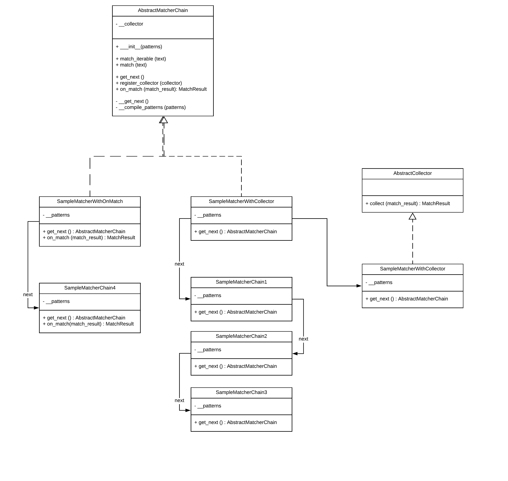

# Motivation

### Most common use cases

- if your business model was constructed on regular expression
- if handling regex bothers you
- if you want to simplify the regexes

### Abilities
- Provides creating chain on regexes. Each chain able to know next. The chain would be completed when regex finds result 
- Match event which in a chain can be handled by on_match function
- All chain results can be handled by a single collector  

### Requirements

` pip install nltk` 

#### Running Tests

`python -m unittest discover -p "*Test.py" ` 
